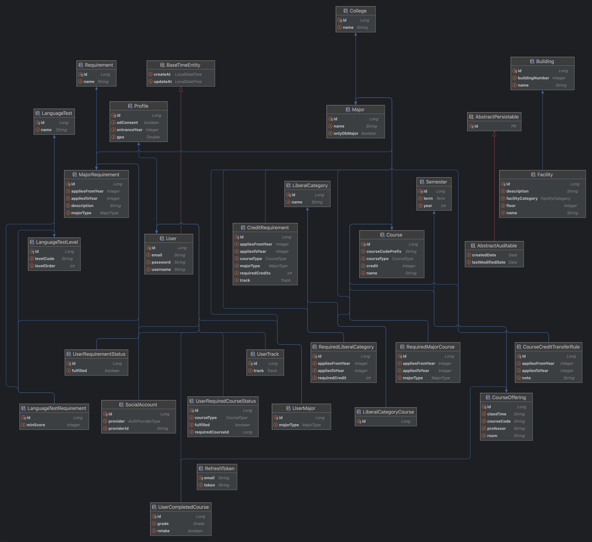

<p align="center">
  
</p>

<h1 align="center" style="font-weight: bold;">WiseOwl Backend</h1>

<p align="center">
  <a href="#1-project-overview">Overview</a> •
  <a href="#2-problem-statement">Problem</a> •
  <a href="#3-key-features">Features</a> •
  <a href="#4-tech-stack">Stack</a> •
  <a href="#5-architecture">Architecture</a> •
  <a href="#6-api-documentation">API</a> •
  <a href="#7-testing">Testing</a> •
  <a href="#8-performance-testing">Performance</a> •
  <a href="#9-deployment">Deployment</a> •
  <a href="#10-demo">Demo</a>
</p>

---

## 1. Project Overview
WiseOwl is a **graduation requirement management service** designed for university freshmen.  
It automatically verifies graduation eligibility based on department, major, and track rules,  
helping students plan and track their academic journey in a structured way.

---

## 2. Problem Statement
- Complex graduation requirements varying by department, major, and track (e.g., thesis, projects, certifications)
- Difficulty for freshmen to intuitively understand academic regulations
- Lack of automated and visualized systems for efficient requirement tracking

---

## 3. Key Features
- User authentication (JWT + Google OAuth2)
- Graduation requirement checks tailored to student’s entrance year, major, and track
- Rule management by major, double major, and track
- Automatic calculation of required course completion status
- Campus map with building- and floor-level facility lookup, categorized by type

---

## 4. Tech Stack
- **Backend**: Spring Boot, Spring Security, JPA (QueryDSL), Gradle
- **Database**: MySQL, Flyway, Testcontainers
- **Infrastructure**: AWS EC2, Docker, Redis
- **Testing**: JUnit5, MockMvc, Testcontainers
- **Frontend**: React

---

## 5. Architecture
- Designed with a **Layered Architecture** (Controller → Service → Repository → Domain)
- Data model represented with an **Entity Relationship Diagram (ERD)**
- Since the ERD is large, a scaled-down version is shown here.  
  Full details are available in the original diagram.

<p align="center">
  
</p>

> [View full ERD](../assets/wiseowl_erd.png)

---

## 6. API Documentation
### Example Endpoints

| Method | Endpoint                                | Description                          |
|--------|-----------------------------------------|--------------------------------------|
| POST   | `/api/auth/signup`                      | User signup with JWT issuance        |
| POST   | `/api/auth/login`                       | Login with JWT issuance              |
| POST   | `/api/auth/oauth/google`                | Google social login (OAuth2)         |
| GET    | `/api/users/me/graduation-requirements` | Fetch graduation requirements by user|
| GET    | `/api/users/me/required-courses`        | Check mandatory course completion    |
| GET    | `/api/users/me/summary`                 | Retrieve user’s academic summary     |
| GET    | `/api/courses/offerings`                | Get course offerings per semester    |
| GET    | `/api/facilities`                       | Retrieve campus buildings & facilities|

 Detailed request/response specs can be found in [API Specification](api-spec.en.md).

---

## 7. Tests
- Unit tests: JUnit5 + Mockito
- Integration tests: Spring Boot + MockMvc
- Testcontainers with MySQL, including Flyway-based DB migrations → provides an isolated environment close to production

```bash
./gradlew test
```

---

## 8. Performance Testing

### Purpose
- Verify API concurrency handling
- Evaluate the effect of HikariCP connection pooling and Redis caching

### Environment
- **Server**: AWS EC2 (Spring Boot, MySQL, Redis, Docker)
- **DB Connection Pool**: HikariCP (default settings)
- **Tool**: k6

### Scenario
- Virtual Users (VUs): 20 → 50 → 100 stepwise load testing
- Target Endpoints: `/grad_info`, `/courses`, `/facilities`, `/user_summary`
- Success Criteria: P95 < 400ms, Error rate < 2%

### Results
| VUs                | Avg (ms) | P95 (ms) | Max (ms) | Error Rate |
|---------------------|----------|----------|----------|------------|
| 20                  | ~47      | ~113     | 848      | 0%         |
| 50                  | ~65      | ~177     | 883      | 0%         |
| 100 (before cache)  | ~1318    | ~2542    | 11898    | 21.2%      |
| 100 (with Redis)    | ~95      | ~210     | 1842     | 0%         |

### Insights
- 20–50 VU: Stable, <200ms response time
- 100 VU (no cache): Heavy DB load → avg 1.3s delay, 21% error rate
- With Redis: Response improved ~14× (1318ms → 95ms), error rate 0%
- Default HikariCP pool size proved most stable under load

### Conclusion
Proper caching strategy and connection pool management are critical for scaling under high traffic.  
With Redis caching, the system maintained stable performance even under 100 VU load.

---

## 9. Deployment
The service is containerized with Docker and deployed on AWS EC2 (Ubuntu).  
Each component runs as a standalone container, with environment variables passed via the `-e` option.

### Backend API
- Spring Boot application built into a Docker image and deployed on EC2
- Communicates with the database and cache over an internal network

### Database
- MySQL 8.0 container
- Stores core data: users, graduation requirements, courses, majors, and facilities

### Caching Server
- Redis container
- Caches frequent queries to improve response speed

### Infrastructure
- EC2 host manually runs each container (`docker run ...`)
- Sensitive values (DB password, JWT secret, etc.) injected via environment variables  

---

## 10. Demo

🔗 [Live Demo](http://wiseowl1.vercel.app)

> ⚠️ Note: The demo currently includes course data only from **Spring 2021 (HUFS)**.  
> Instead of populating every semester, a subset of data was inserted as an example  
> to demonstrate that the service works correctly.  
> The system will function the same way once additional semester data is inserted in the same format.
